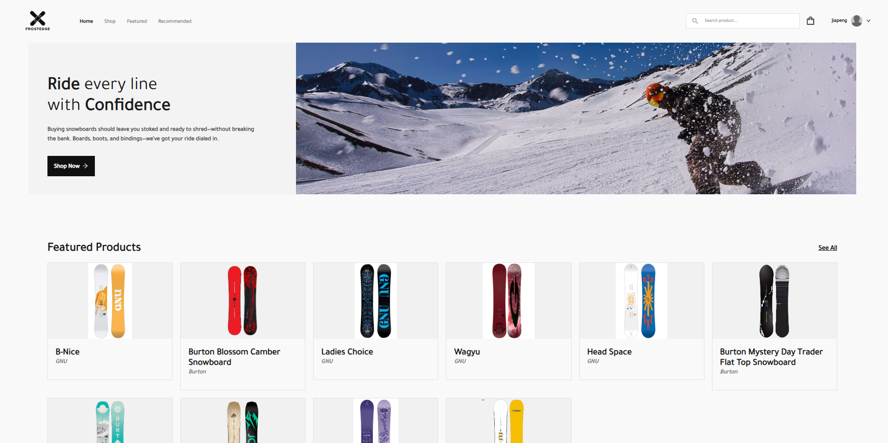
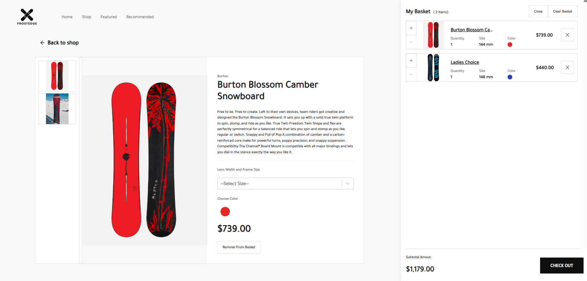
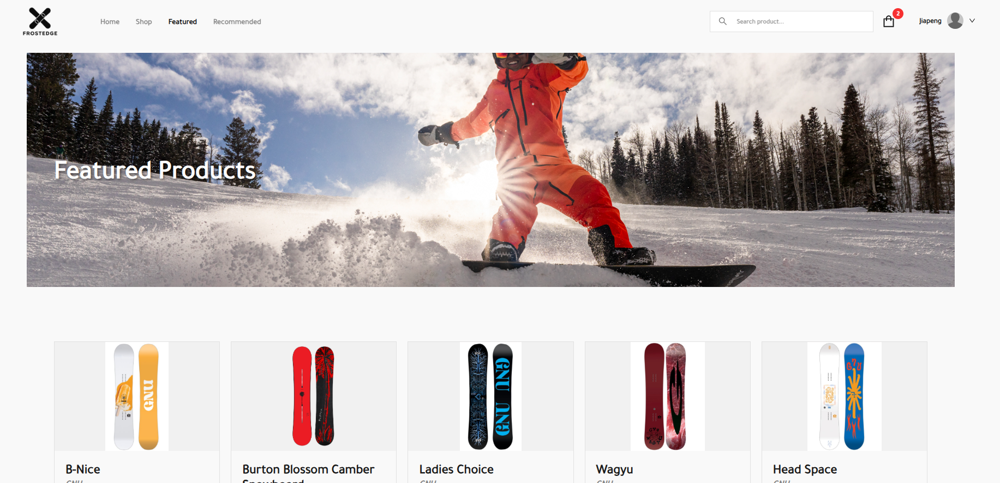
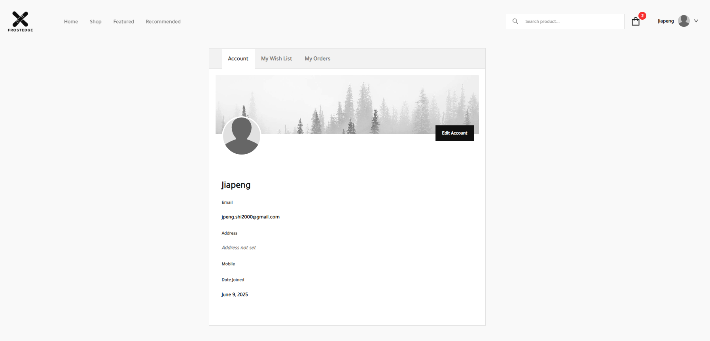
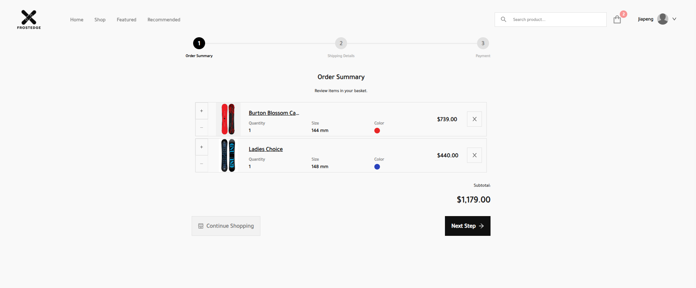

<div align="center">

  <a>
    
  </a>

  <h1 align="center">FrostEdge</h1>

  ### [Live demo](https://snowboard-ecommerce-7a5425471348.herokuapp.com/)

  

</div>

### FrostEdge – Snowboard E-Commerce Website

FrostEdge is a clean and modern online store for snowboards. The site features:

- **Homepage with Featured Products**: Eye-catching hero image with dynamic snowboard product showcases.

- **Product Detail Page**: Users can view detailed snowboard information, select size and color, and add items to their basket.

- **Shopping Cart Sidebar**: A quick-access cart shows selected items, quantities, sizes, colors, and total amount.

- **Multi-Step Checkout Flow**: Users proceed through order summary, shipping details, and payment in a step-by-step layout.

- **User Account Dashboard**: Logged-in users can view and manage their account, wishlist, and order history.  

### Built With
[![JavaScript][JavaScript]][JavaScript-url]
[![React][React]][React-url]
[![Vite][Vite]][Vite-url]
[![HTML][HTML]][HTML-url]
[![Node.js][Node.js]][Node.js-url]
[![Firebase][Firebase]][Firebase-url]

### More Screenshots





## Run Locally
### 1. Install Dependencies
```sh
$ yarn install
```

### 2. Create a new firebase project
Login to your google account and create a new firebase project [here](https://console.firebase.google.com/u/0/)

Create an `.env` file and add the following variables.

```
// SAMPLE CONFIG .env, you should put the actual config details found on your project settings

VITE_FIREBASE_API_KEY=AIzaKJgkjhSdfSgkjhdkKJdkjowf
VITE_FIREBASE_AUTH_DOMAIN=yourauthdomin.firebaseapp.com
VITE_FIREBASE_DB_URL=https://yourdburl.firebaseio.com
VITE_FIREBASE_PROJECT_ID=yourproject-id
VITE_FIREBASE_STORAGE_BUCKET=yourstoragebucket.appspot.com
VITE_FIREBASE_MSG_SENDER_ID=43597918523958
VITE_FIREBASE_APP_ID=234598789798798fg3-034

``` 

After setting up necessary configuration,
create a **Database** and choose **Cloud Firestore** and start in test mode

### 3. Run development server
```sh 
$ yarn dev
```

---

## Build the project
```sh
$ yarn build
```

## How to add products or perform CRUD operations for Admin
1. Navigate to your site to `/signup`
2. Create an account for yourself
3. Go to your firestore collection `users collection` and edit the account you've just created. Change the role from `USER` to `ADMIN`.
4. Reload or sigin again to see the changes. 

**Firebase Admin to be integrated soon**


<!-- Badge Links -->
[JavaScript]: https://img.shields.io/badge/JavaScript-F7DF1E?style=for-the-badge&logo=javascript&logoColor=black
[JavaScript-url]: https://www.javascript.com/

[React]: https://img.shields.io/badge/React-20232A?style=for-the-badge&logo=react&logoColor=61DAFB
[React-url]: https://reactjs.org/

[Vite]: https://img.shields.io/badge/Vite-646CFF?style=for-the-badge&logo=vite&logoColor=white
[Vite-url]: https://vitejs.dev/

[HTML]: https://img.shields.io/badge/HTML5-E34F26?style=for-the-badge&logo=html5&logoColor=white
[HTML-url]: https://html.com/

[CSS]: https://img.shields.io/badge/CSS3-1572B6?style=for-the-badge&logo=css3&logoColor=white
[CSS-url]: https://css3.com/

[Node.js]: https://img.shields.io/badge/Node.js-339933?style=for-the-badge&logo=node.js&logoColor=white
[Node.js-url]: https://nodejs.org/

[Firebase]: https://img.shields.io/badge/Firebase-FFCA28?style=for-the-badge&logo=firebase&logoColor=black
[Firebase-url]: https://firebase.google.com/